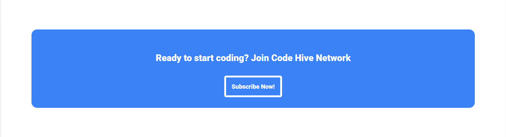

# Odin Landing Page

A simple, responsive landing page built with **HTML** and **CSS**, as part of the [Foundations course](https://www.theodinproject.com/paths/foundations/courses/foundations) from [The Odin Project](https://www.theodinproject.com/).

---

## 🚀 Overview

This project focuses on recreating a professional-looking landing page using foundational web development skills. ```I made a variant of the Odin landing page``` It’s designed to strengthen my understanding of HTML structure, CSS styling, flexbox layout, and responsive design principles.

---

## 📸 Preview





Images of each section

---

## 🛠️ Built With

- HTML5  
- CSS3  
- Flexbox

---

## 📚 What I Learned

- Structuring content with semantic HTML
- Using **Flexbox** for layout and alignment
- Styling with **CSS** to create visually appealing designs
- Consistency in font sizes, colors, and spacing
- Creating a responsive layout
---
## 🔧 Features

- Hero section with call-to-action
- Information section with images and descriptions
- Quote/testimonial section
- Signup call-to-action section
- Footer with copyright
---
## 📈 Future Improvements

- Add animations or transitions
- Make the page fully responsive for all screen sizes
- Implement accessibility best practices (ARIA labels, color contrast)
- Use BEM methodology (Block, Element, Modifier)
---
## Feedback
Any constructive feedback is welcomed. 


